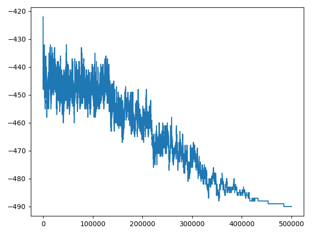
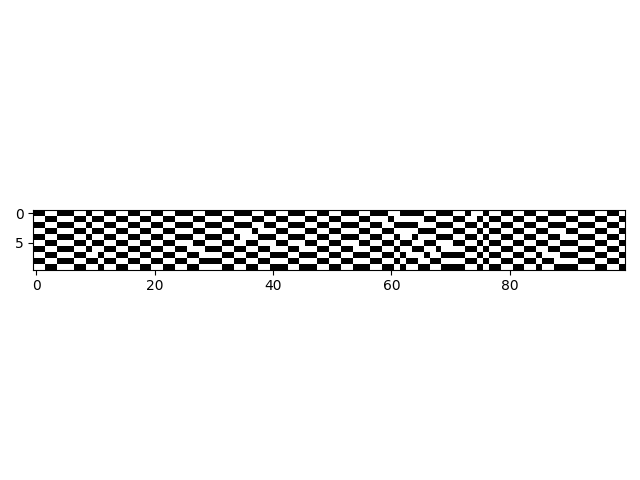

# Where to seat people to maintain social distancing
## A constrained optimization approach to seating arrangements through Simulated Annealing (SA)

**Introduction**

The Covid 19 pandemic has brought with it a complex set 
of restrictions regarding live events. E.g.: 
- one can seat by people of the same social bubble, 
- but must have a free seat at the top and bottom,
- and also two free seats to the sides.

**What is the problem?**

Given a set of already sold tickets to an event, we need
to seat as many of them as possible, while respecting
COVID guidelines.

**Simple example - hello world**

Applying the approach explained below, with the sample
constraints explained in the introduction, to a standium of 1000 people, we can improve,
the number of people which we can fit by about a +15%
of the initial random guess.

In the plot below, it can be seen how the SA algorithm
is much more conservative towards the end of the schedule
budget, due to the exponential decay of the acceptance probability
function.
 

**How do we approach it?**

We don't have a mathematical expression of some analytic
 function we can use to optimize. That is, if we figured
 out a scalar function which, given some parameters, returns
 the number of people we can fit, we could just derive it to
 find its global extrema. However, life is
 not this simple.
 
 Brute forcing the problem could be a solution, but given
 a realistic situation (with a standard number of seats
 and attendees), it has an extremely huge search space. 
 
 However, we can approach the optimization through a
 metaheuristic method; we will be using Simulated Annealing.
 
 **Simulated annealing**
 
 Simulared annealing (SA) is a metaheuristic used to 
 approximate a global optimization in a large search 
 space. This fits exactly our needs! Also, it supports
 the use of discrete variables, which we will make us of.
 SA might be modeled as a random walk through a 
 search graph of the initial guess and its neighbours.
 
    SIMULATED ANNEALING ALGORITHS
        
        Let S = S0.
        Let k = MAX_K.
        WHILE k >= 1:
            Let S' = NEIGHBOUR(S).
            Let T = (k + 1) / MAX_K.
            IF UNIFORM_RANDOM(0, 1) <= P(S, S', T):
                Let S = S'.
            k--
        S
 
 The prior SA algorithm uses a fixed cooling schedule,
 but adptative solutions based on the change rate can
 also be designed.
 
 
 This implies that we will also implement:
  - A function to get a neighbour of a solution, 
  performing a small random mutation to the initial 
  solution.
  - A cost function (a fitness function) to evaluate the
  cost of some solution. In our case, this could be simply
  a negative cost per person we can fit, and positive cost
  if that person is far from the family (e.g.).
  - A function which defines the probability of accepting
  a neighbour.  
  
        P(S, S', T) -> FLOAT:
            IF COST(S') < COST(S):
                RETURN 1
            ELSE:
                RETURN EXP(-(COST(S')-COST(S))/T)
             
  
 [More about simulated annealing.](https://en.wikipedia.org/wiki/Simulated_annealing)
 
 
